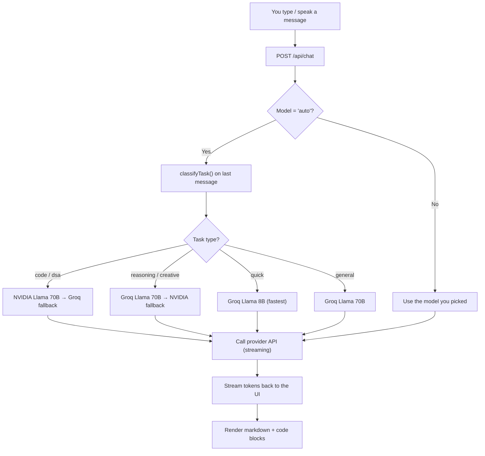
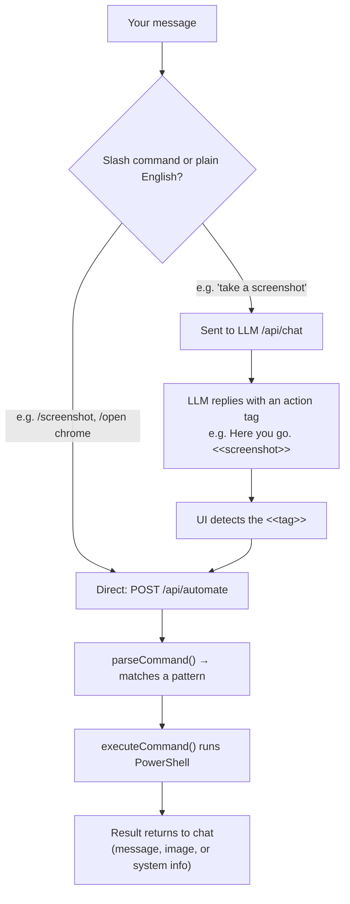
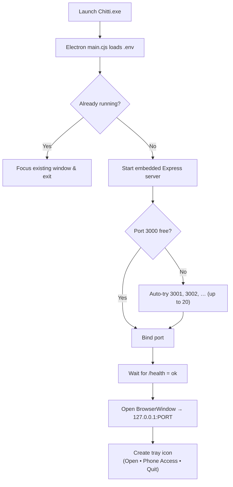
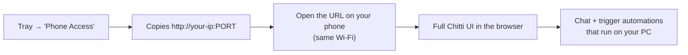

<div align="center">

# 🤖 Chitti

### Your personal AI assistant that actually *runs* your PC.

Chitti is a Windows-native AI assistant that chats like a friend, thinks with the best free LLMs, and **controls your computer** — open apps, take screenshots, check system stats, set volume, and more. Talk to it by typing or by voice, from your desktop **or your phone**.

<br/>


</div>

---

## ✨ What makes Chitti different

| | Feature | Description |
|---|---|---|
| 🧠 | **Smart multi-LLM routing** | Classifies your request (code, DSA, reasoning, creative, quick) and routes it to the best free model automatically — with automatic fallback if a provider is down. |
| 🕹️ | **Real PC control** | Open/close apps, take screenshots, check CPU/RAM/battery, set volume, lock the screen, control media, read/write the clipboard, and Google things — all from chat. |
| 🗣️ | **Voice in, voice out** | Speak to Chitti with your mic (speech recognition) and have it speak replies back (text-to-speech). |
| 📱 | **Use it from your phone** | Runs a local server so any device on your Wi-Fi can open Chitti in a browser and control your PC remotely. Installable as a PWA. |
| ⚡ | **Streaming responses** | Answers stream token-by-token, just like the big assistants. |
| 🖥️ | **Native desktop app** | Ships as an Electron app with a system-tray icon, single-instance lock, and minimize-to-tray. |
| 💾 | **Private by default** | Conversations and settings live in your browser's local storage. Your API keys stay in a local `.env`. |

---

## 🧩 Architecture at a glance

```
┌──────────────────────────────────────────────────────────────┐
│                      Electron Desktop App                      │
│  (system tray • single instance • minimize-to-tray)            │
│                                                                │
│   ┌───────────────────────┐        ┌────────────────────────┐ │
│   │   React UI (Vite)     │  HTTP  │   Express Server        │ │
│   │  chat • voice • PWA   │◄──────►│   :3000 (auto-fallback) │ │
│   └───────────────────────┘        └───────────┬────────────┘ │
│                                                 │              │
│                          ┌──────────────────────┼───────────┐ │
│                          │                       │           │ │
│                   ┌──────▼──────┐      ┌─────────▼────────┐   │ │
│                   │  /api/chat  │      │  /api/automate   │   │ │
│                   │  LLM router │      │  PowerShell exec │   │ │
│                   └──────┬──────┘      └─────────┬────────┘   │ │
│                          │                       │            │ │
└──────────────────────────┼───────────────────────┼────────────┘
                           │                       │
              ┌────────────▼───────────┐   ┌───────▼─────────┐
              │  Groq · NVIDIA · ...   │   │  Windows / PS    │
              │   (free LLM APIs)      │   │  apps • system   │
              └────────────────────────┘   └──────────────────┘
```

The **same Express server** powers both the desktop window and any phone on the network — the Electron window is just a browser pointed at `127.0.0.1`.

---

## 🔄 How it works (flows)

### 1. Chat + smart routing flow

When you send a message with the model set to **Auto**, Chitti classifies the task and picks the best model for it.



**Routing table** (task → preferred models, in fallback order):

| Task type | Detected by keywords like… | Routed to |
|---|---|---|
| `code` | function, api, refactor, react, spring, docker… | NVIDIA 70B → Groq Mixtral → Groq 70B |
| `dsa` | algorithm, leetcode, bfs, dp, big o… | NVIDIA 70B → Groq 70B → Mixtral |
| `reasoning` | explain, compare, trade-off, design… | Groq 70B → NVIDIA 70B |
| `creative` | write, draft, email, summarize… | Groq 70B → NVIDIA 70B |
| `quick` | what is, define, translate, list… | Groq 8B → NVIDIA 8B → Groq 70B |
| `general` | *(anything else)* | Groq 70B → NVIDIA 70B |

### 2. PC automation flow (the fun part)

Chitti can *do things* on your machine. There are two ways an action gets triggered:



**What Chitti can control:**

| Command tag | Slash command | Does |
|---|---|---|
| `<<open:APP>>` | `/open chrome` | Launches a desktop app **or** a web app (WhatsApp, YouTube, Gmail…) |
| `<<close:APP>>` | `/close notepad` | Kills a running app |
| `<<screenshot>>` | `/ss` | Captures the primary screen and returns it inline |
| `<<sysinfo>>` | `/sysinfo` | CPU, free/total RAM, disk, battery, last boot |
| `<<search:QUERY>>` | `/search react hooks` | Opens a Google search |
| `<<url:SITE>>` | `/url github.com` | Opens a website |
| `<<volume:LEVEL>>` | `/volume 50` | Sets volume (0–100, `mute`, `unmute`) |
| `<<lock>>` | `/lock` | Locks the workstation |
| `<<media:ACTION>>` | `/media next` | play / pause / next / previous |
| `<<apps>>` | `/apps` | Lists apps with a visible window |
| `<<clipboard>>` | `/clipboard` | Reads current clipboard contents |

> Natural language works too — "open whatsapp", "how's my pc", "mute", "lock my computer", "what's running" all map to the right action.

### 3. Startup / runtime flow



### 4. Phone access flow



---

## 🚀 Getting started

### Prerequisites
- **Node.js 22+**
- **Windows** (automation features use PowerShell)
- At least one free API key (see below)

### 1. Get free API keys

Chitti works with multiple providers — you only need **one** to start, but more means better routing and fallback.

| Provider | Get a free key at | Best for |
|---|---|---|
| **Groq** | [console.groq.com](https://console.groq.com) | reasoning, creative, speed |
| **NVIDIA NIM** | [build.nvidia.com](https://build.nvidia.com) | code, DSA, reasoning |
| **Cerebras** | [cloud.cerebras.ai](https://cloud.cerebras.ai) | fastest inference |

### 2. Configure your environment

```bash
cp .env.example .env
```

Then edit `.env`:

```ini
GROQ_API_KEY=gsk_your_key_here
NVIDIA_API_KEY=nvapi-your_key_here
CEREBRAS_API_KEY=your_key_here
PORT=3000
```

### 3. Install dependencies

```bash
npm install
```

### 4. Run it

```bash
# Web dev mode (hot reload UI at http://localhost:5173, needs the server too)
npm run dev

# Full production server (builds UI + serves it on http://localhost:3000)
npm run prod

# Native desktop app (Electron)
npm run electron:dev
```

Then open **http://localhost:3000** — or grab your phone and visit `http://<your-pc-ip>:3000`.

---

## 📦 Building distributables

| Command | Output | Notes |
|---|---|---|
| `npm run build` | `dist/` | Bundles the React front-end with Vite |
| `npm run bundle` | `server.bundle.cjs` | Builds UI + bundles the server with esbuild |
| `npm run exe` | `release/Chitti.exe` | Single portable executable (pkg, Node 22 Win x64) |
| `npm run electron:build` | `release-desktop/` | Windows installer (NSIS) with desktop + start-menu shortcuts |

> When packaged, Chitti reads `.env` from the folder next to the executable, so you can ship the app and drop in keys separately.

---

## 🗂️ Project structure

```
Chitti/
├── electron/
│   └── main.cjs          # Electron main process: window, tray, env, lifecycle
├── public/               # PWA manifest, icons, service worker
├── src/
│   ├── Chitti.jsx        # The entire React UI (chat, voice, settings, routing)
│   └── main.jsx          # React entry point
├── server.js             # Express API: /api/chat (LLM router) + /api/automate
├── automation.js         # Windows control: apps, screenshots, system, media…
├── generate-icons.js     # Icon generation helper
├── index.html            # App shell
├── vite.config.js        # Vite config
└── package.json          # Scripts, deps, Electron/pkg build config
```

---

## ⚙️ Tech stack

- **Frontend:** React 19, Vite 6, `react-markdown` + `remark-gfm`, `lucide-react` icons, Web Speech API (STT + TTS), PWA/service worker
- **Backend:** Express 5, native `fetch` streaming proxy, keyword-based task classifier + routing engine
- **Automation:** Node `child_process` driving PowerShell (Start-Process, CIM/WMI queries, `System.Drawing` screenshots, media keys)
- **Desktop / packaging:** Electron 42, electron-builder (NSIS), `@yao-pkg/pkg`, esbuild

---

## 🔐 Notes on safety & privacy

- API keys live only in your local `.env` — never bundled into the UI.
- Conversations and settings are stored in your browser's `localStorage`, not sent anywhere except the LLM provider you chose.
- Destructive actions are guarded: `shutdown`/`restart` intentionally return a manual command instead of executing, so nothing powers off by accident.
- Automation only runs on the machine hosting the server. Anyone on your local network who opens the URL can trigger actions, so use it on trusted networks.

---

<div align="center">

Built with care for people who'd rather *talk* to their computer than click around it.

</div>
